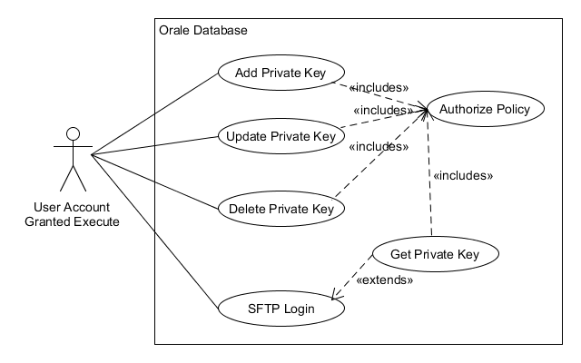

# Protecting/Hiding Data in Oracle

## The Ask

While experimenting with [as_sftp](https://github.com/antonscheffer/as_sftp), a package by Anton Scheffer
that implements a Secure File Transfer Protocol (SFTP) utility in Oracle PL/SQL, I encountered an issue (or want)
of storing SSH private keys in the database. That opens a can of worms because private keys should be secured as
much as possible.

On a Unix system the private keys are kept in files in ~/.ssh directory with permissions set to be readable only by
the user login associated with that HOME directory. Of course anyone with root or sudo privs can get the file, but
that is the level of security we have come to expect for SSH client implementations. It is also one of the reasons
some corporations have issues with ssh and go to lengths to prevent using it except where absolutely necessary. I digress.

I need to store private keys in the database with the following requirements:

- Not visible to any user except the schema owner (and DBA, but only because we can't keep them out).
- Accessible to a particular procedure that calls the *login* method of *as_sftp*.
- Not accessible to any other procedures or queries.
- Not visible to the schema owner if possible. The reason for this odd seeming requirement is that in most corporate systems a schema owner for deployed code is a shared account. Even if it is protected from login, there are multiple developers who deploy code into the schema. We want to control access to the single deployer and the procedure that needs the private key.

| *Hiding Data Use Cases* |
|:--:|
|  |

I can see altering the use case to have separate privileges for the DML operations versus the SFTP Login,
but I'm going to combine them for now.

As shown in the diagram, the authorized user does not have a use case for obtaining the private key directly
or even to tell that there is a key available. That is by design.

## Options

I considered a package with the source obfuscated via the utility *wrap*. From the documentation though

> Although wrapping a compilation unit helps to hide the algorithm and makes reverse-engineering difficult, Oracle Corporation does not recommend it as a secure method for hiding passwords or table names. Obfuscating a PL/SQL unit prevents most users from examining the source code, but might not stop all attempts.

It might be good enough for our use case, but there are other issues. This package or function will be executable
by the schema owner, who in our target environment is a shared account. We also do not control all database security
and a surprising number of other accounts may have elevated privliges 
including EXECUTE ANY PROCEDURE (yea, don't. OK. Not my circus. Not my monkeys.).

As for storing the key in a table, even more frequently found in the wild is the grant of SELECT ANY TABLE.

I considered putting some sort of encryption on the text of the key in the table, but that just kicks the can around
because now the key for that encryption needs to be stored somewhere. Not helpful.

I briefly flirted with using a Context, but it has to be loaded somehow and we are back to protecting that operation.

I settled on Oracle Fine-Grained Access Control (See Oracle Database Security Guide and *DBMS_RLS* for your release). 

The solution won't stop that person with EXECUTE ANY PROCEDURE from
running our login procedure which uses our private key (shame on the DBA!), but it prevents them from grabbing 
the private key and using it elsewhere. Even this issue might be solved if we add a check for calling *user*
in the policy, but I have not gone there yet.

There is an extensive amount of debug logging available in *as_sftp*. I have not taken the time to explore
it all to see if the private keys can be exposed.

I am not a security expert. It is possible there are more glaring holes in what I have built. Everything I've checked
suggests this is good against any but a SYSDBA privileged user account, yet I'm not going to claim
this is a secure solution. I just do not know. This is an exercise in implementing Fine Grained
Access Control.


## Fine Grained Access Control Configuration

The documentation and examples center around use of a context that you populate with a login trigger
to restrict access to particular logins or scenarios as to how the session was entered. Much of that does
not fit my use case.

What does fit is that we can install functions that control whether or not a SELECT, INSERT, UPDATE or DELETE
operation will or will not work based on logic we implement. In this context "not work" means a SELECT will return 0
rows but no error, while a DML operation will return either 0 rows updated/deleted, or in the case of insert, a policy error
exception. No user or procedure can manipulate the data in this table without passing our policy check.

The exceptions to this are that the schema owner can perform DDL on the table including TRUNCATE and DROP, and 
anyone with SYSDBA priv can do whatever they want. These conditions are acceptable to me. To take it any further
we would need to create a separate schema for the table and packages. That might be best, but in most corporate environments, it
is expensive to do. That said, if I was installing *as_sftp* as a DBA for general use that is where I would go with it.

My intent is for the policy check functions to look at the call stack and only allow the operation to succeed
if we are called by a specific schema owned package function/procedure. Mostly that means my supplemental *login* procedure
that retrieves the private key and calls *as_sftp.login*.

## Implementation

This implementation is for a single schema owner. If it was to be shared across multiple schemas, there
would likely need to be an additional primary key field in the table for **who** is running the operation. 
That would also need to consider how Mr. Scheffer configured the *as_sfpt_known_hosts* operation. It may be
possible to define this with INVOKER rights and force each schema owner to implement their own tables,
but that seems draconian. Tracking everything by the *user* identification of the caller would be my choice.

### as_sftp_private_keys Table

```sql
CREATE TABLE as_sftp_private_keys
(
    host  VARCHAR2(1000) NOT NULL
    ,id   VARCHAR2(128) NOT NULL
    ,key  CLOB NOT NULL
    ,CONSTRAINT as_sftp_private_keys_pk PRIMARY KEY(host, id)
);
```

### as_sftp_keymgmt Package Specfication

```sql
CREATE OR REPLACE PACKAGE as_sftp_keymgmt AS
    --
    -- Important! The private key lookup is case sensitive on i_host and i_user.
    --
    PROCEDURE login(i_host VARCHAR2, i_user VARCHAR2, i_passphrase VARCHAR2 := NULL, i_log_level pls_integer := null);
-- comment out this function when done testing. It should not be public
    --FUNCTION get_priv_key(i_host VARCHAR2, i_user VARCHAR2) RETURN CLOB;
    --
    -- When keymgmt_security is activated (fine grained access control)
    -- These three methods are the only way to manipuate the data in the table as_sftp_private_keys
    -- other than to truncate it or do the task as sysdba.
    -- You cannot read the data at all as get_priv_key is a private function that only login() can call.
    --
    PROCEDURE insert_priv_key(i_host VARCHAR2, i_user VARCHAR2, i_key CLOB);
    PROCEDURE update_priv_key(i_host VARCHAR2, i_user VARCHAR2, i_key CLOB);
    PROCEDURE delete_priv_key(i_host VARCHAR2, i_user VARCHAR2);
END as_sftp_keymgmt;
```
While testing I made the function *get_priv_key* public so that I could validate what it was doing.
It should be private.

The procuedure *login* will lookup the private key (using *get_priv_key*) and call *as_sftp.login* using it.

The three DML procedures allow operations on individual private key records for anyone granted execute
on the package. As noted, it might be better to put those in a separate package.

So far what we have implemented will work without installing the fine grained access control components. Although
anyone with SELECT priv on the table can see our keys, the storage of keys and use of them automatically
during login will work much like SSH/SFTP does on Unix by looking up the key.

### as_sftp_keymgmt_security PACKAGE Specification

*as_sftp_keymgmt_security* package implements the policy checks that will, when installed via *DBMS_RLS*, control
whether access to table *as_sftp_private_keys* is permitted.

```sql
CREATE OR REPLACE PACKAGE as_sftp_keymgmt_security
AS
    --
    -- These control access to records in the table as_sftp_private_keys
    --
    FUNCTION user_data_select_security (owner VARCHAR2, objname VARCHAR2)
    RETURN VARCHAR2;
    FUNCTION user_data_insert_security (owner VARCHAR2, objname VARCHAR2)
    RETURN VARCHAR2;
    FUNCTION user_data_update_security (owner VARCHAR2, objname VARCHAR2)
    RETURN VARCHAR2;
    FUNCTION user_data_delete_security (owner VARCHAR2, objname VARCHAR2)
    RETURN VARCHAR2;
END as_sftp_keymgmt_security;
```

We will explore the package body after seeing how it is tied to the table.

### install_keymgmt_security.sql

This install script associates the functions in package *as_sftp_keymgmt_security* with each of the operations 'SELECT',
'INSERT', 'UPDATE', 'DELETE' on table *as_sftp_private_keys*.

The package *as_sftp_keymgmt_security* must be 
both publicly executable and have a public synonym for this to work. If you do not have
the privilege to create a public synonym, the DBA must do it for you. 

You may also need the DBA to 'GRANT EXECUTE ON DBMS_RLS TO **your_schema**;', though it is common enough to grant
it to 'PUBLIC'.

Of note is that the *add_policy* for 'INSERT' uses an additional parameter because 'INSERT' statements do 
not have 'WHERE' clauses. The implementation checks your condition after the insert, then raises an EXCEPTION
if the operation is not allowed. This is different than the others where it quietly adds a WHERE condition
to cause your operation to not match any rows.

```sql
GRANT EXECUTE ON as_sftp_keymgmt_security TO public;
CREATE OR REPLACE PUBLIC SYNONYM as_sftp_keymgmt_security FOR lee.as_sftp_keymgmt_security ;
BEGIN
    BEGIN
        DBMS_RLS.drop_policy('LEE', 'AS_SFTP_PRIVATE_KEYS', 'USER_DATA_SELECT_POLICY');
    EXCEPTION WHEN OTHERS THEN NULL;
    END;
    DBMS_RLS.add_policy('LEE', 'AS_SFTP_PRIVATE_KEYS', 'USER_DATA_SELECT_POLICY',
                      'LEE', 'AS_SFTP_KEYMGMT_SECURITY.USER_DATA_SELECT_SECURITY',
                      'SELECT');
    BEGIN
        DBMS_RLS.drop_policy('LEE', 'AS_SFTP_PRIVATE_KEYS', 'USER_DATA_INSERT_POLICY');
    EXCEPTION WHEN OTHERS THEN NULL;
    END;
    DBMS_RLS.add_policy('LEE', 'AS_SFTP_PRIVATE_KEYS', 'USER_DATA_INSERT_POLICY',
                      'LEE', 'AS_SFTP_KEYMGMT_SECURITY.USER_DATA_INSERT_SECURITY',
                      'INSERT'
                    ,TRUE -- needed because insert does not have where clause. check condition after insert
                );
    BEGIN
        DBMS_RLS.drop_policy('LEE', 'AS_SFTP_PRIVATE_KEYS', 'USER_DATA_UPDATE_POLICY');
    EXCEPTION WHEN OTHERS THEN NULL;
    END;
    DBMS_RLS.add_policy('LEE', 'AS_SFTP_PRIVATE_KEYS', 'USER_DATA_UPDATE_POLICY',
                      'LEE', 'AS_SFTP_KEYMGMT_SECURITY.USER_DATA_UPDATE_SECURITY',
                      'UPDATE');
    BEGIN
        DBMS_RLS.drop_policy('LEE', 'AS_SFTP_PRIVATE_KEYS', 'USER_DATA_DELETE_POLICY');
    EXCEPTION WHEN OTHERS THEN NULL;
    END;
    DBMS_RLS.add_policy('LEE', 'AS_SFTP_PRIVATE_KEYS', 'USER_DATA_DELETE_POLICY',
                      'LEE', 'AS_SFTP_KEYMGMT_SECURITY.USER_DATA_DELETE_SECURITY',
                      'DELETE');
END;
```

### as_sftp_keymgmt_security Package Body

Now we get to the fun stuff. How are we determining that ONLY a specific package and method are allowed access?
We look at the call stack. It is tricky though because the *DBMS_RLS* operations insert themselves into the
call stack! You must look back a few levels to find the original caller.

```sql
CREATE OR REPLACE PACKAGE BODY as_sftp_keymgmt_security IS
    FUNCTION user_data_select_security (owner VARCHAR2, objname VARCHAR2)
    RETURN VARCHAR2
    IS
        v_owner varchar2(1024);
        v_name varchar2(1024);
        v_lineno number;
        v_caller_t varchar2(1024);

        v_depth BINARY_INTEGER := UTL_CALL_STACK.dynamic_depth;
    BEGIN
        IF v_depth < 4 THEN
            DBMS_OUTPUT.put_line('security check found not called by LEE.AS_SFTP_KEYMGMT.GET_PRIV_KEY.');
            dbms_output.put_line('call stack less than 4: '||v_depth);
            DBMS_OUTPUT.put_line('Not allowing rows to be selected.');
            RETURN '1=0';
        END IF;
        /*
        FOR i in 1..v_depth
        LOOP
            v_owner := UTL_CALL_STACK.owner(i);
            v_name := UTL_CALL_STACK.concatenate_subprogram(UTL_CALL_STACK.subprogram(i));
            dbms_output.put_line('i='||i||' owner: '||v_owner||' name: '||v_name);
        END LOOP;
        */
        v_owner := UTL_CALL_STACK.owner(4);
        v_name := UTL_CALL_STACK.concatenate_subprogram(UTL_CALL_STACK.subprogram(4));
        --dbms_output.put_line('owner: '||v_owner||' name: '||v_name);
        --owa_util.who_called_me(v_owner, v_name, v_lineno, v_caller_t);
        --dbms_output.put_line('owner: '||v_owner||' name: '||v_name||' lineno: '||v_lineno||' caller_t: '||v_caller_t);
        --dbms_output.put_line(DBMS_UTILITY.format_call_stack);
        IF v_owner = 'LEE' AND v_name = 'AS_SFTP_KEYMGMT.GET_PRIV_KEY' THEN
            RETURN NULL;
        ELSE
            DBMS_OUTPUT.put_line('security check found not called by LEE.AS_SFTP_KEYMGMT.GET_PRIV_KEY.');
            DBMS_OUTPUT.put_line('was called by owner: '||v_owner||' name: '||v_name);
            DBMS_OUTPUT.put_line('Not allowing rows to be selected.');
            RETURN '1=0';
        END IF;
        --RETURN NULL;
    END user_data_select_security
    ;

    FUNCTION user_data_insert_security (owner VARCHAR2, objname VARCHAR2)
    RETURN VARCHAR2
    IS
        v_owner varchar2(1024);
        v_name varchar2(1024);
        v_lineno number;
        v_caller_t varchar2(1024);

        v_depth BINARY_INTEGER := UTL_CALL_STACK.dynamic_depth;
    BEGIN
        IF v_depth < 4 THEN
            DBMS_OUTPUT.put_line('security check found not called by LEE.AS_SFTP_KEYMGMT.INSERT_PRIV_KEY.');
            dbms_output.put_line('call stack less than 4: '||v_depth);
            DBMS_OUTPUT.put_line('Not allowing rows to be selected.');
            RETURN '1=0';
        END IF;
        /*
        FOR i in 1..v_depth
        LOOP
            v_owner := UTL_CALL_STACK.owner(i);
            v_name := UTL_CALL_STACK.concatenate_subprogram(UTL_CALL_STACK.subprogram(i));
            dbms_output.put_line('i='||i||' owner: '||v_owner||' name: '||v_name);
        END LOOP;
        */
        v_owner := UTL_CALL_STACK.owner(4);
        v_name := UTL_CALL_STACK.concatenate_subprogram(UTL_CALL_STACK.subprogram(4));
        --dbms_output.put_line('owner: '||v_owner||' name: '||v_name);
        --owa_util.who_called_me(v_owner, v_name, v_lineno, v_caller_t);
        --dbms_output.put_line('owner: '||v_owner||' name: '||v_name||' lineno: '||v_lineno||' caller_t: '||v_caller_t);
        --dbms_output.put_line(DBMS_UTILITY.format_call_stack);
        IF v_owner = 'LEE' AND v_name = 'AS_SFTP_KEYMGMT.INSERT_PRIV_KEY' THEN
            RETURN NULL;
        ELSE
            DBMS_OUTPUT.put_line('security check found not called by LEE.AS_SFTP_KEYMGMT.INSERT_PRIV_KEY.');
            DBMS_OUTPUT.put_line('was called by owner: '||v_owner||' name: '||v_name);
            DBMS_OUTPUT.put_line('Not allowing rows to be inserted.');
            RETURN '1=0';
        END IF;
        --RETURN NULL;
    END user_data_insert_security
    ;
    FUNCTION user_data_update_security (owner VARCHAR2, objname VARCHAR2)
    RETURN VARCHAR2
    IS
        v_owner varchar2(1024);
        v_name varchar2(1024);
        v_lineno number;
        v_caller_t varchar2(1024);

        v_depth BINARY_INTEGER := UTL_CALL_STACK.dynamic_depth;
    BEGIN
        IF v_depth < 4 THEN
            DBMS_OUTPUT.put_line('security check found not called by LEE.AS_SFTP_KEYMGMT.UPDATE_PRIV_KEY.');
            dbms_output.put_line('call stack less than 4: '||v_depth);
            DBMS_OUTPUT.put_line('Not allowing rows to be selected.');
            RETURN '1=0';
        END IF;
        /*
        FOR i in 1..v_depth
        LOOP
            v_owner := UTL_CALL_STACK.owner(i);
            v_name := UTL_CALL_STACK.concatenate_subprogram(UTL_CALL_STACK.subprogram(i));
            dbms_output.put_line('i='||i||' owner: '||v_owner||' name: '||v_name);
        END LOOP;
        */
        v_owner := UTL_CALL_STACK.owner(4);
        v_name := UTL_CALL_STACK.concatenate_subprogram(UTL_CALL_STACK.subprogram(4));
        --dbms_output.put_line('owner: '||v_owner||' name: '||v_name);
        --owa_util.who_called_me(v_owner, v_name, v_lineno, v_caller_t);
        --dbms_output.put_line('owner: '||v_owner||' name: '||v_name||' lineno: '||v_lineno||' caller_t: '||v_caller_t);
        --dbms_output.put_line(DBMS_UTILITY.format_call_stack);
        IF v_owner = 'LEE' AND v_name = 'AS_SFTP_KEYMGMT.UPDATE_PRIV_KEY' THEN
            RETURN NULL;
        ELSE
            DBMS_OUTPUT.put_line('security check found not called by LEE.AS_SFTP_KEYMGMT.UPDATE_PRIV_KEY.');
            DBMS_OUTPUT.put_line('was called by owner: '||v_owner||' name: '||v_name);
            DBMS_OUTPUT.put_line('Not allowing rows to be updated.');
            RETURN '1=0';
        END IF;
        --RETURN NULL;
    END user_data_update_security
    ;

    FUNCTION user_data_delete_security (owner VARCHAR2, objname VARCHAR2)
    RETURN VARCHAR2
    IS
        v_owner varchar2(1024);
        v_name varchar2(1024);
        v_lineno number;
        v_caller_t varchar2(1024);

        v_depth BINARY_INTEGER := UTL_CALL_STACK.dynamic_depth;
    BEGIN
        IF v_depth < 4 THEN
            DBMS_OUTPUT.put_line('security check found not called by LEE.AS_SFTP_KEYMGMT.DELETE_PRIV_KEY.');
            dbms_output.put_line('call stack less than 4: '||v_depth);
            DBMS_OUTPUT.put_line('Not allowing rows to be selected.');
            RETURN '1=0';
        END IF;
        /*
        FOR i in 1..v_depth
        LOOP
            v_owner := UTL_CALL_STACK.owner(i);
            v_name := UTL_CALL_STACK.concatenate_subprogram(UTL_CALL_STACK.subprogram(i));
            dbms_output.put_line('i='||i||' owner: '||v_owner||' name: '||v_name);
        END LOOP;
        */
        v_owner := UTL_CALL_STACK.owner(4);
        v_name := UTL_CALL_STACK.concatenate_subprogram(UTL_CALL_STACK.subprogram(4));
        --dbms_output.put_line('owner: '||v_owner||' name: '||v_name);
        --owa_util.who_called_me(v_owner, v_name, v_lineno, v_caller_t);
        --dbms_output.put_line('owner: '||v_owner||' name: '||v_name||' lineno: '||v_lineno||' caller_t: '||v_caller_t);
        --dbms_output.put_line(DBMS_UTILITY.format_call_stack);
        IF v_owner = 'LEE' AND v_name = 'AS_SFTP_KEYMGMT.DELETE_PRIV_KEY' THEN
            RETURN NULL;
        ELSE
            DBMS_OUTPUT.put_line('security check found not called by LEE.AS_SFTP_KEYMGMT.DELETE_PRIV_KEY.');
            DBMS_OUTPUT.put_line('was called by owner: '||v_owner||' name: '||v_name);
            DBMS_OUTPUT.put_line('Not allowing rows to be deleted.');
            RETURN '1=0';
        END IF;
        --RETURN NULL;
    END user_data_delete_security
    ;
END as_sftp_keymgmt_security;
```

Much of the code is repeated so I could have refactored it. Maybe later.

### as_sftp_keymgmt PACKAGE BODY

Implementation of the methods to do the login and DML is anticlimatic.

```sql
CREATE OR REPLACE PACKAGE BODY as_sftp_keymgmt AS
    --
    -- This is the only method to select the private key when fine grained access control is added to the table
    -- with as_sftp_keymgt_security package. It is a package private function only called by login()
    --
    FUNCTION get_priv_key(i_host VARCHAR2, i_user VARCHAR2)
    RETURN CLOB
    IS
        v_clob CLOB;
    BEGIN
        SELECT key INTO v_clob
        FROM as_sftp_private_keys k
        WHERE host = i_host AND k.id = i_user
        ;
        RETURN v_clob;
    EXCEPTION
        WHEN NO_DATA_FOUND THEN
            raise_application_error(-20713, 'no record found in table as_sftp_private_keys for host='||i_host||', id='||i_user);
    END ;

    --
    -- The method for obtaining the private key and using it to call as_sftp.login
    --
    PROCEDURE login(i_host VARCHAR2, i_user VARCHAR2, i_passphrase VARCHAR2 := NULL, i_log_level pls_integer := null)
    IS
        v_priv_key VARCHAR2(32767) := get_priv_key(i_host, i_user);
    BEGIN
        as_sftp.login(i_log_level => i_log_level, i_user => i_user, i_priv_key => v_priv_key, i_passphrase => i_passphrase);
    END;

    --
    -- 3 DML methods for manipulating the key table records
    --
    PROCEDURE insert_priv_key(i_host VARCHAR2, i_user VARCHAR2, i_key CLOB)
    IS
    BEGIN
        INSERT INTO as_sftp_private_keys(host, id, key) VALUES(i_host, i_user, i_key);
        COMMIT;
    END insert_priv_key;

    PROCEDURE update_priv_key(i_host VARCHAR2, i_user VARCHAR2, i_key CLOB)
    IS
    BEGIN
        UPDATE as_sftp_private_keys
            SET key = i_key
            WHERE host = i_host AND id = i_user
            ;
        COMMIT;
    END update_priv_key;

    PROCEDURE delete_priv_key(i_host VARCHAR2, i_user VARCHAR2)
    IS
    BEGIN
        DELETE FROM as_sftp_private_keys
            WHERE host = i_host AND id = i_user
            ;
        COMMIT;
    END delete_priv_key;
END as_sftp_keymgmt;
```

## Conclusion

The code will soon be a public repository on my github page at [as_sftp_keymgmt](https://github.com/lee-lindley/as_sftp_keymgmt).
It is private at this moment as I haven't created the README. Should be up soon.

I am not sure I enjoyed this exercise, but I learned enough about Oracle Fine Grained Access Control to accomplish
my goal. Hope it was helpful.
